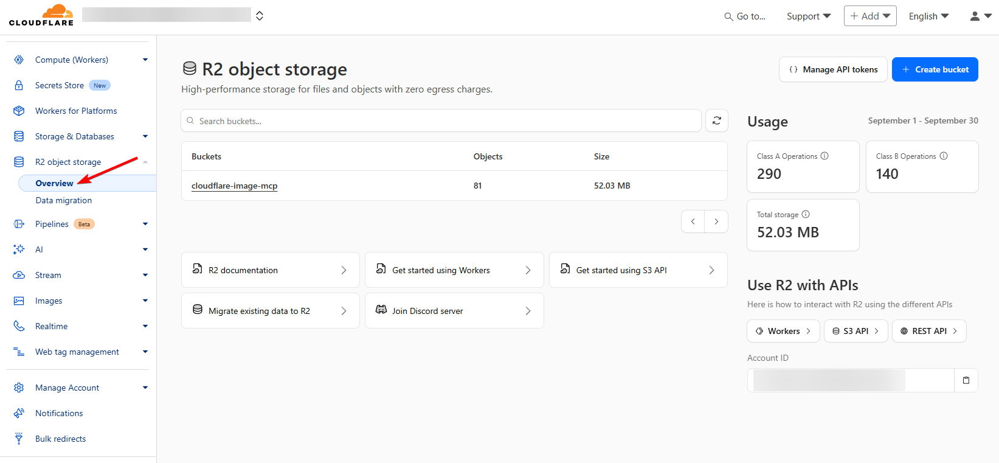
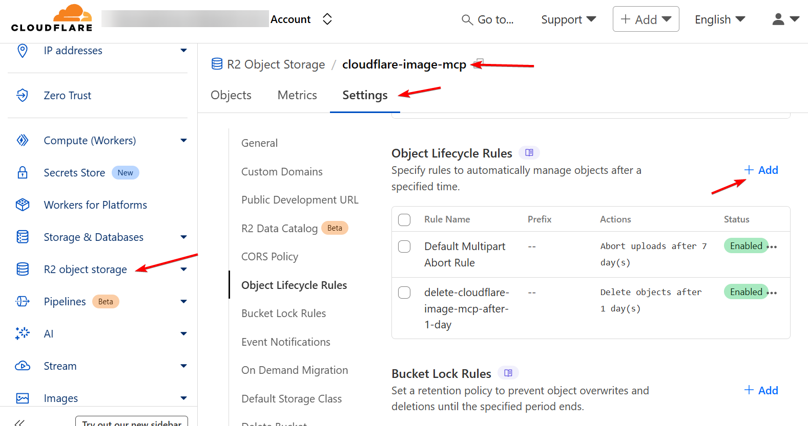

# Environment Variable Setup

## Part 0: Overview

Below is a guide on how to get the environment variables to setup this `cloudflare-image-mcp`.

All available environment variables:
```bash
# Cloudflare Workers AI configuration
CLOUDFLARE_API_TOKEN="your_api_token_here"
CLOUDFLARE_ACCOUNT_ID="your_account_id_here"

# S3 storage configuration
S3_BUCKET="cloudflare-image-mcp"
S3_REGION="auto"
S3_ACCESS_KEY="your_access_key"
S3_SECRET_KEY="your_secret_key"
S3_ENDPOINT="https://your-account-id.r2.cloudflarestorage.com"
S3_CDN_URL="https://pub-....r2.dev"

# Cleanup configuration
IMAGE_CLEANUP_ENABLED="true"
IMAGE_CLEANUP_OLDER_THAN="1d"
```

## Part 1: Setup programmatic access to Cloudflare Workers AI

### Step 1: Create a Cloudflare account
Go to [https://dash.cloudflare.com/sign-up](https://dash.cloudflare.com/sign-up)


## Step 2: Get Cloudflare Account ID

To get `CLOUDFLARE_ACCOUNT_ID`, go to https://dash.cloudflare.com/, and then click 'Overview', and scroll down until you see 'Account ID'. 


### Step 3: Go to Manage Account > Account API Tokens, or just straight to [https://dash.cloudflare.com/profile/api-tokens](https://dash.cloudflare.com/profile/api-tokens)

To retrieve Cloudflare API Token to programmatically access image generation model in Cloudflare Workers AI:


### Step 4: Select Create Token and fill in the token name, permissions, and the optional expiration date for the token.


After done, select Continue to summary and review the details. And your token is created.


## Part 2: Setting up Cloudflare R2 as storage provider for generated images

### Step 1: Create a Cloudflare account
Go to [https://dash.cloudflare.com/sign-up](https://dash.cloudflare.com/sign-up)

### Step 2: Go to R2 on the left hand panel



*Note: You may need to put your credit card details here.*

### Step 3: Create a bucket

Create a R2 bucket called `cloudflare-image-mcp`, which you could use it for `S3_BUCKET` environment variable.


### Step 4: Make a note of the public details on the settings page

Remember to enable public acess of your storage bucket, by (i) enabling Public Development URL and (ii) make Allowed Origins for 'CORS policy' to be `*`.

Also, here you can get the `S3_ENDPOINT` and `S3_CDN_URL` in format as below:

```bash
S3_ENDPOINT="https://your-account-id.r2.cloudflarestorage.com"

S3_CDN_URL="https://pub-xxxxxxxxxxxxxxxxxxxxxxxxxxxxxxxx.r2.dev"
```


### Step 5: Access (secrets)


Also, here you can get the `S3_ACCESS_KEY` and `S3_SECRET_KEY` in format as below:

```bash
S3_ACCESS_KEY="your_access_key"
S3_SECRET_KEY="your_secret_key"
```


### Step 6 (Optional): Automatic Cleanup of AI-Generated Images on Cloudflare R2

Use object lifecycle rules to automate the management or deletion of objects in Cloudflare R2 after a specified time.




## References
1. Cloudflare Docs - Create API token [https://developers.cloudflare.com/fundamentals/api/get-started/create-token/](https://developers.cloudflare.com/fundamentals/api/get-started/create-token/)
2. How to setup Cloudflare R2 bucket & generate access key [https://dev.to/jacksbridger/how-to-setup-cloudflare-r2-bucket-generate-access-key-4icd](https://dev.to/jacksbridger/how-to-setup-cloudflare-r2-bucket-generate-access-key-4icd)