# Environment Variable Setup

## Overview

This guide covers all environment variables needed to run the cloudflare-image-mcp project.

## Environment Variables

### Cloudflare Configuration (Required)

```bash
# Cloudflare API Token (needs AI and Workers AI permissions)
CLOUDFLARE_API_TOKEN="your_api_token_here"

# Cloudflare Account ID
CLOUDFLARE_ACCOUNT_ID="your_account_id_here"
```

### R2/S3 Storage Configuration (Required for storage features)

```bash
# R2 bucket name
S3_BUCKET="cloudflare-image-mcp-images"

# Region (use "auto" for R2)
S3_REGION="auto"

# R2 endpoint URL (get from R2 dashboard)
S3_ENDPOINT="https://your-account-id.r2.cloudflarestorage.com"

# R2 credentials (create in R2 dashboard > Manage R2 API tokens)
S3_ACCESS_KEY="your_access_key"
S3_SECRET_KEY="your_secret_key"

# Public CDN URL for images (configure in R2 dashboard > Settings > Public access)
# If not provided, the system will auto-detect it via Cloudflare API (requires BUCKET_NAME)
S3_CDN_URL="https://pub-your-id.r2.dev"
```

### Server Configuration (Optional)

```bash
# Server port (default: 3000)
PORT=3000

# Image expiry time in hours (default: 24)
IMAGE_EXPIRY_HOURS=24

# Default model (@cf/black-forest-labs/flux-1-schnell, @cf/black-forest-labs/flux-2-klein-4b, @cf/black-forest-labs/flux-2-dev, @cf/stabilityai/stable-diffusion-xl-base-1.0, @cf/bytedance/stable-diffusion-xl-lightning, @cf/lykon/dreamshaper-8-lcm)
DEFAULT_MODEL="@cf/black-forest-labs/flux-1-schnell"

# Timezone for logging and R2 folder structure (default: UTC)
# Examples: America/New_York, Asia/Singapore, Europe/London, UTC
TZ="UTC"
```

## File Locations

| Variable | File |
|----------|------|
| All local variables | `packages/local/.env` |
| Workers secrets | Cloudflare Dashboard (wrangler secrets) |

## Part 1: Cloudflare Workers AI Setup

### Step 1: Get Cloudflare Account ID

1. Go to https://dash.cloudflare.com/
2. Click 'Overview'
3. Scroll down to find 'Account ID'

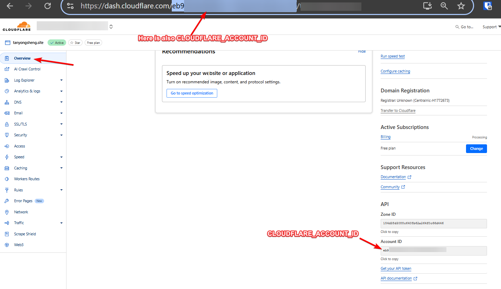

### Step 2: Create API Token

1. Go to https://dash.cloudflare.com/profile/api-tokens
2. Click 'Create Token'
3. Configure with these permissions:
   - **Workers AI**: Read
   - **Workers AI**: Write
   - **Account R2**: Read
   - **Account R2**: Write

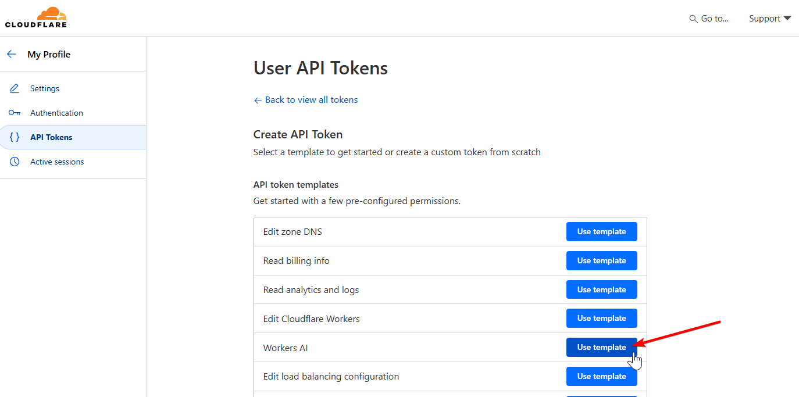

4. Fill in token name and settings:

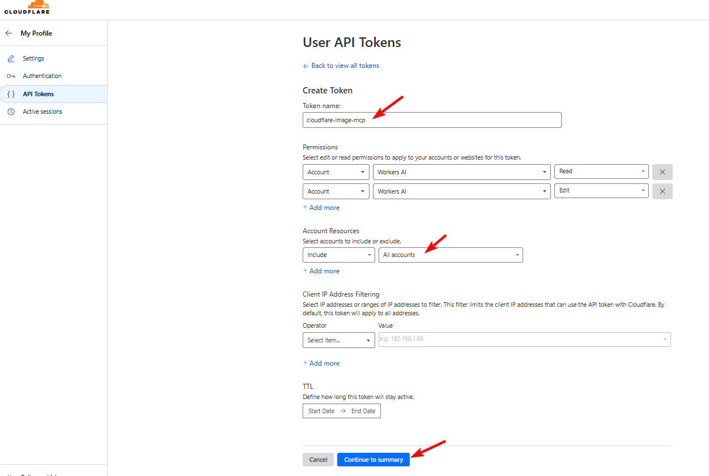

5. Review and create:

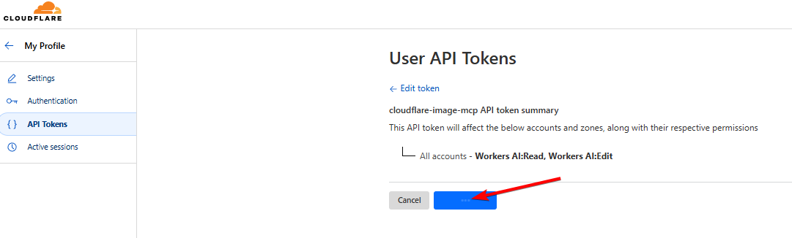

6. Copy your API token:

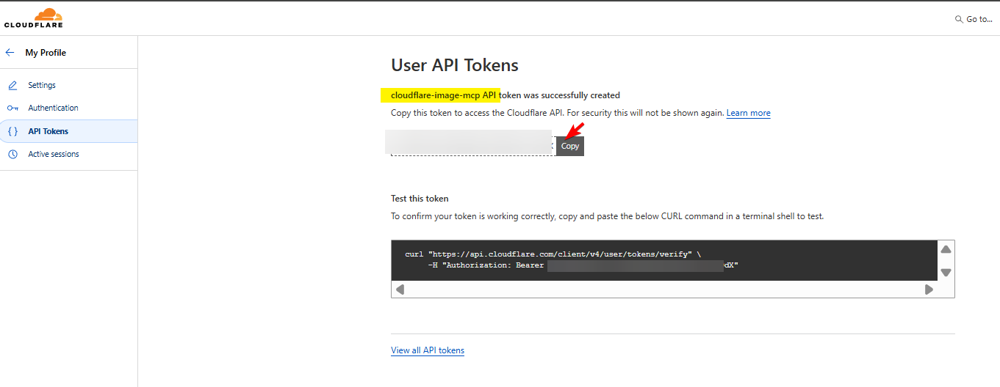

## Part 2: Cloudflare R2 Storage Setup

### Step 1: Create R2 Bucket

1. Go to R2 in Cloudflare Dashboard
2. Click 'Create Bucket'
3. Name it `cloudflare-image-mcp-images`

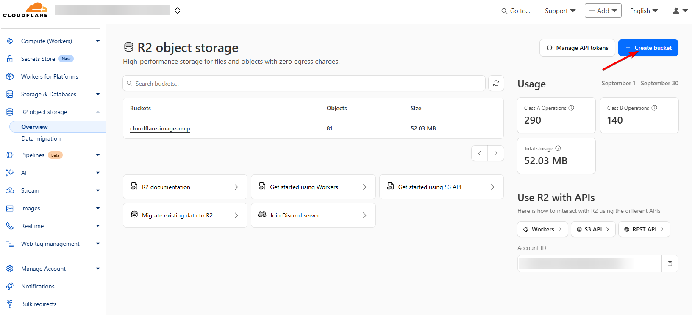

### Step 2: Enable Public Access

1. Go to bucket Settings
2. Enable 'Public access to bucket'
3. Set Allowed Origins to `*` for CORS

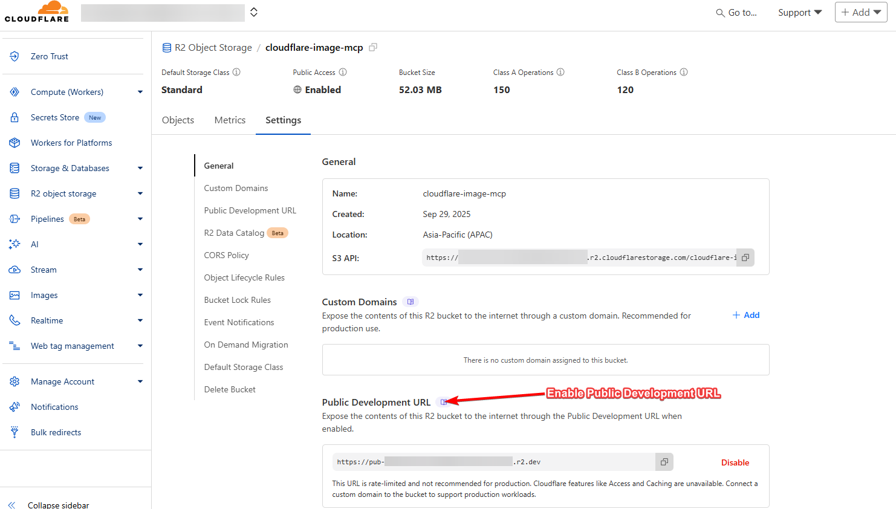

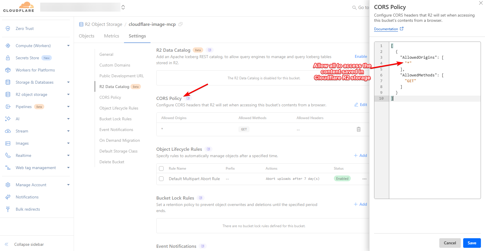

### Step 3: Create R2 API Token

1. Go to R2 > Manage R2 API Tokens
2. Create a new token with:
   - **Permissions**: Object Read, Object Write
   - **TTL**: Optional (or no expiration)

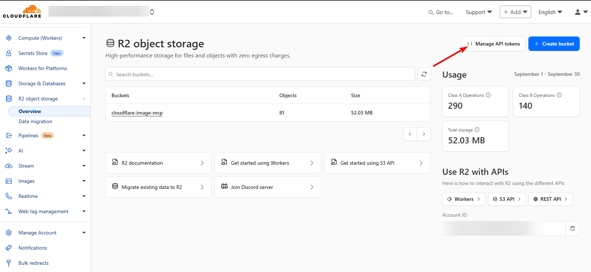

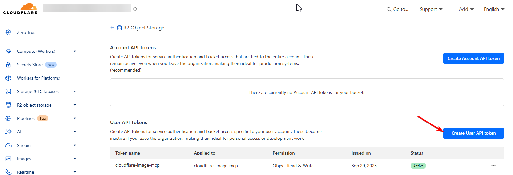

3. Copy the Access Key ID and Secret Access Key:

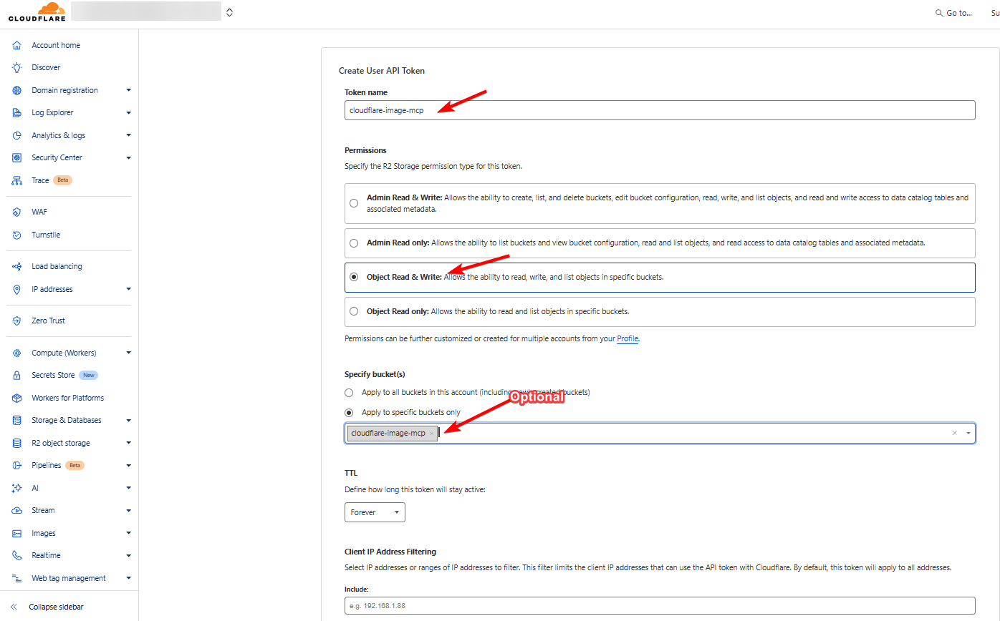

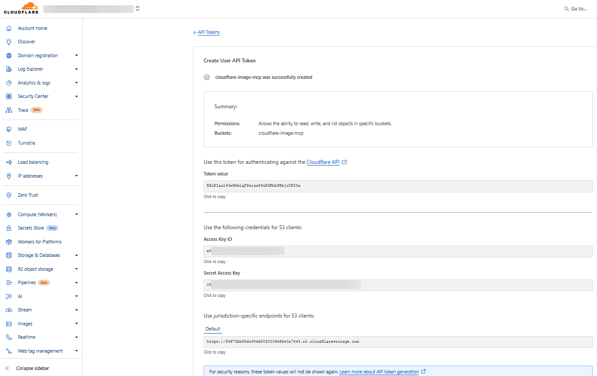

### Step 4: Get Endpoint URLs

From R2 bucket Settings, note:
- **S3_ENDPOINT**: `https://<account-id>.r2.cloudflarestorage.com`
- **S3_CDN_URL**: `https://pub-<id>.r2.dev` (shown after enabling public access)

## Setting Up Local Development

### 1. Copy Example Environment File

```bash
cp packages/local/.env.example packages/local/.env
```

### 2. Fill In Your Values

Edit `packages/local/.env`:

```bash
# Cloudflare
CLOUDFLARE_API_TOKEN="ey..."
CLOUDFLARE_ACCOUNT_ID="3574999..."

# R2 Storage
S3_BUCKET="cloudflare-image-mcp-images"
S3_REGION="auto"
S3_ENDPOINT="https://3574999.r2.cloudflarestorage.com"
S3_ACCESS_KEY="your_access_key"
S3_SECRET_KEY="your_secret_key"
S3_CDN_URL="https://pub-xxx.r2.dev"

# Optional
PORT=3000
IMAGE_EXPIRY_HOURS=24
DEFAULT_MODEL="@cf/black-forest-labs/flux-1-schnell"
TZ="UTC"  # Timezone for logging and R2 folder creation
```

### 3. Start Local Server

```bash
cd packages/local
npm run dev
```

Access at http://localhost:3000

## Setting Up Cloudflare Workers

### 1. Set Secrets

```bash
cd workers

# Set each secret
npx wrangler secret put CLOUDFLARE_API_TOKEN
npx wrangler secret put CLOUDFLARE_ACCOUNT_ID
```

### 2. Deploy

```bash
npx wrangler deploy
```

## Troubleshooting

### API Token Not Working

- Ensure token has correct permissions
- Check token hasn't expired

### R2 Access Denied

- Verify Access Key ID and Secret Access Key
- Ensure R2 API token has Object Read/Write permissions
- Check bucket name matches exactly

### Public URL Not Loading

- Verify public access is enabled in R2 settings
- Check CORS allowed origins includes your domain or `*`

## References

- [Cloudflare Docs - Create API Token](https://developers.cloudflare.com/fundamentals/api/get-started/create-token/)
- [Cloudflare R2 Setup Guide](https://developers.cloudflare.com/r2/get-started/)
- [R2 with S3 Compatibility](https://developers.cloudflare.com/r2/api/s3/)
